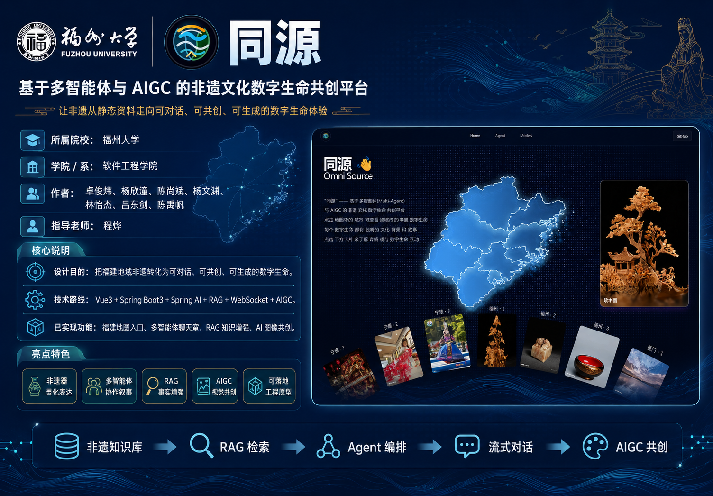

# 《同源》作品简介一页文案

> 用途：整理成 `920 × 640` 的参赛作品简介图。该尺寸承载信息有限，建议采用“标题 + 基本信息 + 三个核心说明 + 功能闭环 + 亮点关键词”的版式，突出当前已完成的工程能力，不需要把全部接口和模块铺满。

## 标题区

**同源：基于多智能体与 AIGC 的非遗文化数字生命共创平台**

副标题：让福建非遗从静态资料走向可对话、可协作、可生成、可沉浸展示的数字生命体验。

## 基本信息区

| 项目 | 内容 |
|---|---|
| 所属院校 | 福州大学 |
| 学院 / 系 | 软件工程学院 |
| 作者 | 卓俊炜、杨欣潼、陈尚斌、杨文渊、林怡杰、吕东剑、陈禹帆 |
| 指导老师 | 程烨 |
| 展示素材 | 校徽、海峡主题 Logo、首页地图截图、Agent 聊天室、AI 生图结果、WebGL 画廊 / 3D 展示 |

## 设计目的

传统非遗数字化多停留在图文展示、目录检索和单向讲解，用户只能被动观看。《同源》将福建九地市代表性非遗组织为具有人设、知识边界、协作能力和生成能力的文化 Agent，让用户可以通过地图进入非遗内容，在聊天室中与多个“数字生命”对话，并围绕非遗原型生成视觉作品。

## 技术路线

前端采用 **Vue 3 + Vite + Tailwind CSS + ECharts + OGL + Three.js + GSAP**，实现福建地图入口、非遗画廊、Agent 聊天室、AIGC 生图面板、无限 WebGL 画廊和 3D 模型展示；移动端采用 **UniApp**，提供首页、对话、智能体和图鉴页面原型。

后端采用 **Spring Boot 3.3 + Spring AI + MyBatis + MySQL + Redis + Milvus + WebSocket + OSS**，接入通义千问兼容模型、Embedding、图像生成、图像理解、Tavily 搜索和 DashScope Fun-ASR，形成“非遗知识库 → RAG 检索 → Agent 编排 → 流式群聊 → AIGC 生图 → OSS 归档 → 前端实时呈现”的闭环。

## 当前已实现功能

- **福建地域非遗入口**：首页通过福建地图联动非遗画廊，覆盖福州、厦门、泉州、漳州、莆田、南平、三明、龙岩、宁德九地市，每地展示 3 个代表性非遗项目。
- **27 个文化 Agent**：后端预置 27 个福建非遗智能体，具备名称、头像、性格、人设提示词、知识范围、语言风格和约束规则。
- **持久化多智能体聊天室**：用户可创建聊天室，选择 1-6 个 Agent，支持历史房间、成员增删、消息分页、反馈标记和 WebSocket 流式回复。
- **RAG 事实增强**：默认加载 `Util/standardList.jsonl` 非遗知识库，优先使用 Milvus 向量检索，异常时自动回退到本地相似度检索，回答基于资料并降低幻觉。
- **多 Agent 协作问答**：支持一次性多智能体问答、证据链、冲突洞察、可信度评估，并可按需开启 Tavily 联网搜索补充。
- **AIGC 图像共创**：用户可指定房间内 Agent 生成图像，系统会结合 Agent 人设和原型图构建提示词，结果上传 OSS、写入聊天记录并实时广播到聊天室。
- **语音与多模态能力**：提供图片理解接口和 `/ws/voice` 实时语音识别通道，支持普通话与闽南语参数。
- **沉浸式展示端**：Web 端包含 OGL 无限画廊、全屏浏览和 Three.js 3D 模型页；UniApp 端提供移动展示原型。
- **系统画像与工具接口**：提供 `/api/system-profile` 展示系统技术画像，并实现 MCP 风格工具注册与调用能力。

## 创新性与实用性特点

1. **非遗器灵化表达**：将非遗项目转化为有头像、有性格、有知识边界、有语言风格的数字生命。
2. **多智能体群聊协作**：围绕同一问题由多个非遗 Agent 分工回答，支持房间化管理和实时流式体验。
3. **RAG + 搜索 + 可信度链路**：结合本地知识库、Milvus、本地回退、联网搜索、证据链和可信度评估，使回答更可解释。
4. **生成式文化共创**：用户不仅能阅读和提问，还能让指定非遗 Agent 生成视觉作品并沉淀到会话中。
5. **WebGL 沉浸展示**：通过地图、画廊、无限网格和 3D 模型增强非遗内容的可视化表达。
6. **可落地工程原型**：已具备前后端、移动端、数据库持久化、实时通信、对象存储、接口文档和答辩用系统画像。

## 海报推荐主文案

《同源》不是一个静态非遗展示页，而是一套让福建非遗“可进入、可对话、可协作、可生成、可沉淀”的数字生命共创平台。

## 一页图建议保留信息

- 主标题：同源
- 副标题：基于多智能体与 AIGC 的非遗文化数字生命共创平台
- 三个核心能力：福建非遗地图入口、多智能体流式群聊、AIGC 图像共创
- 技术闭环：知识库 → RAG 检索 → Agent 编排 → WebSocket 流式对话 → AIGC 生图 → OSS 归档
- 亮点标签：27 个非遗 Agent、RAG 事实增强、联网搜索补充、语音识别、WebGL/3D 展示、UniApp 移动端

