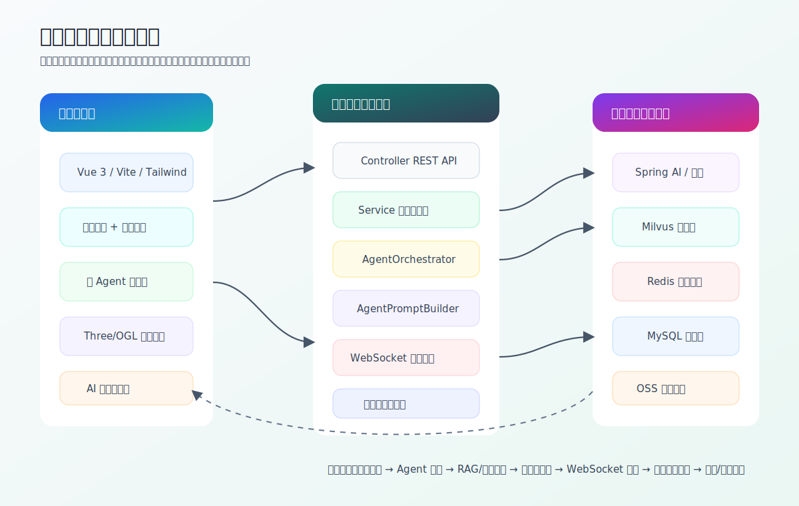

# 参赛作品说明书

## 封面信息

| 项目 | 内容 |
|---|---|
| 作品名称 | 同源：基于多智能体与 AIGC 的非遗文化数字生命共创平台 |
| 学校 | 福州大学 |
| 学院（系） | 软件工程学院 |
| 专业班别 | 【请填写】 |
| 学生姓名 | 卓俊炜、杨欣潼、陈尚斌、杨文渊、林怡杰、吕东剑、陈禹帆 |
| 指导教师 | 程烨 |
| 完成时间 | 2026 年 5 月 |

## 一、作品简介

《同源》是一套面向福建非遗文化数字传播的智能交互平台。作品以“非遗数字生命”为核心概念，将福建九地市代表性非遗内容转化为可对话、可协作、可生成图像、可在 3D/动态界面中展示的文化 Agent。用户既可以通过福建地图和环形画廊浏览地域非遗，也可以进入多智能体聊天室，与不同器灵 Agent 进行实时对话，还可以让指定 Agent 依据自身文化原型生成图像作品。

作品不是单一的问答机器人，而是一套完整的“非遗知识库 + 多智能体调度 + RAG 事实增强 + AIGC 视觉共创 + WebSocket 流式交互 + WebGL 沉浸展示”的工程系统。其目标是让传统非遗从静态展品转化为具有角色感、记忆感、互动感和生成能力的数字生命。

## 二、总体架构

系统采用前后端分离与分层架构：

| 层级 | 技术 / 模块 | 说明 |
|---|---|---|
| 用户体验层 | Vue 3、Vite、Tailwind CSS、ECharts、OGL、Three.js | 首页地图、非遗画廊、Agent 聊天室、AI 生图、3D 模型展示 |
| 实时交互层 | WebSocket、SSE、流式消息协议 | Agent 开始、分片、结束、图片、错误、进度等事件推送 |
| 业务编排层 | Spring Boot 3、Controller、Service、Orchestrator | 聊天室、Agent 管理、RAG 检索、AIGC 生图、上传归档 |
| AI 能力层 | Spring AI、ChatClient、Embedding、图像生成、多模态分析 | 文本生成、视觉理解、文生图、参考图生图 |
| 数据支撑层 | MySQL、MyBatis、Redis、Milvus、OSS | 结构化数据、缓存状态、向量检索、图片归档 |
| 工程保障层 | 统一响应、全局异常、测试、接口文档、系统画像接口 | 保证演示、联调、答辩和后续扩展 |

新增的 `/api/system-profile` 技术画像接口将数据库、AI 调度、前端渲染、数据流和创新关键词结构化输出，便于答辩演示和后续接入后台看板。

## 三、数据库设计

数据库围绕“Agent、文化主题、聊天室、消息、生成任务”五类核心对象设计，既支撑普通业务流程，也服务于 AI 生成链路。

### 1. Agent 预设角色表

`agent` 表保存文化 Agent 的核心配置，包括 `agent_code`、名称、头像、角色类型、性格、人设模板、知识范围、语言风格、约束、最大回复长度、温度参数、排序和启用状态。该表相当于平台的“数字生命配置中心”。

技术价值：

- 支持数据库驱动的 Agent 扩展，不需要每次新增角色都改核心调度逻辑。
- `knowledge_scope` 用于相关度匹配，配合 `AgentOrchestrator` 选择发言者。
- `prompt_template`、`constraints`、`temperature`、`top_p` 共同构成 Agent 的个性化生成参数。
- 支持普通知识型 Agent 与 `NO_RAG` 沉浸式 Agent 双模式。

### 2. 非遗主题表

`cultural_theme` 表保存主题编码、名称、分类、封面图、地区、年代和知识摘要。它可以作为展览入口、地图入口和 Agent 聊天主题的统一索引。后续可扩展为多媒体知识单元，接入图片、音频、视频和文献来源。

### 3. 聊天室与成员表

`chat_room` 表记录用户创建的文化对话空间，包含房间编码、用户、主题、名称、成员数和消息数。`chat_room_member` 表记录房间中的用户和 Agent 成员，支持同一个房间组合不同的非遗数字生命。

技术价值：

- 支持 1-6 个 Agent 组成临时文化圆桌。
- 用户可按主题创建房间，也可后续增删 Agent。
- 为多 Agent 群聊、历史追溯和房间级 WebSocket 广播提供数据基础。

### 4. 聊天消息表

`chat_message` 表记录文本、图片、系统消息、流式消息批次 `stream_id`、发送者类型、头像、搜索开关和扩展元数据。它是整个系统的“文化记忆层”。

技术价值：

- 支持用户消息、Agent 回复、系统提示、图片生成结果同表沉淀。
- `is_stream` 与 `stream_id` 支撑流式消息拼接和历史还原。
- `message_type` 区分 TEXT、IMAGE、EMOJI 等多模态信息。
- 后续可扩展引用来源、RAG 片段、评分、审核状态等元数据。

### 5. 图像生成任务表

`image_generation_task` 表记录文生图任务的 `task_id`、用户、房间、Prompt、风格、状态、进度、结果地址、错误信息和模型名称。它解决了 AIGC 生图耗时长、状态不可见、结果难追踪的问题。

技术价值：

- 支持 PENDING、PROCESSING、SUCCESS、FAILED 等任务状态。
- Redis 缓存任务状态，MySQL 持久化最终结果。
- 图片结果上传 OSS 后回写消息表，形成“生成 - 归档 - 对话”的闭环。

## 四、背后 AI 调度设计

系统的 AI 调度不是简单把用户问题转发给大模型，而是分为“Agent 选择、知识检索、Prompt 组装、模型调用、流式广播、结果沉淀”六个阶段。

### 1. Agent 发言选择

`AgentOrchestrator` 根据房间内 Agent 的 `knowledge_scope` 与用户问题进行相关度评分，选择最适合回答的 Agent。系统同时使用 Redis 记录 Agent 发言冷却时间，避免某个 Agent 连续抢答，增强群聊自然度。

调度策略包括：

- 问题命中某个知识范围时优先选择相关 Agent。
- 普通问题最多选择 3 个 Agent，避免信息噪声。
- 当用户输入“你们”“大家”“所有人”等关键词时，触发房间内 Agent 共同回答。
- 当用户输入“自由讨论”“你们聊”等关键词时，启用接力发言机制。
- Redis 以房间和 Agent 为维度记录冷却时间，形成轻量级对话节奏控制。

### 2. RAG 知识增强

`RagServiceImpl` 从 `Util/standardList.jsonl` 加载非遗资料，优先通过千问 Embedding 生成向量并同步至 Milvus。检索时使用 COSINE 相似度召回相关片段，再交给 AgentPromptBuilder 写入 Prompt。

为了提升比赛演示稳定性，系统设计了双检索保障：

- **向量检索**：Milvus + Embedding，适合语义相近但措辞不同的问题。
- **本地兜底检索**：当 Milvus 或外部 Embedding 服务不可用时，基于标题、内容、地区、类别、级别、代表作品等字段进行字符相似度评分。

### 3. Prompt 工程

`AgentPromptBuilder` 是系统的 Prompt 引擎。它把 Agent 人设、性格、知识范围、语言风格、约束、RAG 资料、联网搜索补充资料和用户问题组装为完整 Prompt，并明确资料优先级：

`Agent 人设约束 > RAG 检索资料 > 联网搜索补充资料 > 模型自身知识`

这使系统既有角色沉浸感，又能避免文化内容“幻觉”。对于特殊叙事型角色，系统支持 `NO_RAG` 模式，不拼接知识库资料，只围绕角色记忆、感受和情绪作答。

### 4. 流式生成与 WebSocket 广播

`AgentChatServiceImpl` 使用 Spring AI 的流式接口生成内容。每个 Agent 回复都会分配独立 `streamId`，并向房间广播：

- `AGENT_START`：前端创建一个空消息气泡。
- `AGENT_CHUNK`：前端按分片追加文字，形成打字机效果。
- `AGENT_END`：消息结束，写入数据库并补全 messageId。
- `IMAGE`：图片生成后作为图片消息进入聊天室。
- `ERROR`：生成失败时显示系统错误。

前端 `useMultiAgentChat` 使用 `streamId -> message index` 映射管理流式消息，保证多个 Agent 同时输出时不会串流。

### 5. AIGC 图像生成调度

`AIGCController` 支持用户选择某个 Agent 生成图片。系统会自动读取该 Agent 的名称、编码、性格、头像和原型参考图 URL，构造更稳定的生图 Prompt，再调用图像生成模型。

`ImageGenerationServiceImpl` 负责：

- 创建任务并写入 `image_generation_task`。
- 将任务状态同步至 Redis。
- 调用图像模型生成图片。
- 下载生成图并上传至 OSS。
- 将图片作为聊天室消息保存并广播。

这使图像生成不只是孤立输出，而是进入群聊上下文，成为新的文化讨论素材。

## 五、前端 3D / WebGL 渲染设计

作品前端不仅是普通页面，还引入了多种沉浸式视觉表达：

### 1. 首页地图与画廊

首页使用福建地图作为文化入口，点击城市后联动底部非遗图像画廊。右侧翻转卡片展示当前非遗项目，正面显示图像，背面显示说明。该设计把地域、非遗项目和视觉内容合并成低门槛入口。

### 2. OGL 无限 3D 画廊

`InfiniteGridClass` 基于 OGL 构建 3D 无限滚动网格。其核心机制包括：

- 使用 3×3 tile group 架构制造无限滚动错觉。
- 每个 tile 由前景纹理和背景模糊纹理组成。
- 通过 Canvas 2D 动态生成卡片纹理。
- 使用 Raycast 处理点击和悬停交互。
- 使用 GSAP InertiaPlugin 实现惯性滑动。
- 支持后处理效果，包括 distortion、vignette 等视觉增强。
- 通过 DisposalManager 管理 WebGL 资源释放，降低长时间演示的内存压力。

### 3. Three.js 模型展示

`DataPage.vue` 提供 3D 模型展示能力，使用 Three.js、OrbitControls、GLTFLoader、OBJLoader、MTLLoader 加载模型，并通过相机适配、光照、缩放和旋转控制，让非遗相关模型或数字资产可以在浏览器中查看。

### 4. 动效与体验

前端还使用 FlickeringGrid、AgentBackground、CircularGallery、FlipCard、BlurReveal、ProgressiveBlur 等组件塑造数字文化空间感。整体视觉不是传统后台风格，而是面向展览、答辩和公众传播的沉浸式界面。

## 六、数据流与业务闭环

### 1. 问答数据流

用户输入问题 → WebSocket 收到消息 → 保存用户消息 → 查询房间 Agent → AgentOrchestrator 选择发言者 → RagService 检索知识片段 → AgentPromptBuilder 组装 Prompt → Spring AI 流式生成 → WebSocket 分片广播 → 前端实时渲染 → 消息写入 MySQL。

### 2. 图像生成数据流

用户选择 Agent 并输入画面描述 → AIGCController 构造参考图 Prompt → ImageGenerationService 创建任务 → 调用图像模型 → 下载生成图 → OSS 归档 → 更新任务状态 → 保存图片消息 → WebSocket 广播图片结果。

### 3. 3D 展示数据流

非遗图片/模型资源 → 前端资源配置 → Canvas 或 WebGL 纹理生成 → OGL / Three.js 场景渲染 → 鼠标/触摸事件交互 → 点击进入详情或模型展示页。

## 七、团队分工

| 成员 | 主要工作 |
|---|---|
| 卓俊炜 | 总体架构、后端核心服务、多智能体调度、RAG 与 WebSocket 流式链路 |
| 杨欣潼 | 前端首页、地图交互、画廊视觉、页面动效与交互体验 |
| 陈尚斌 | 数据库设计、MyBatis 映射、聊天室与消息持久化 |
| 杨文渊 | AIGC 生图链路、OSS 上传、图片消息归档 |
| 林怡杰 | 非遗资料整理、知识库 JSONL 构建、素材组织 |
| 吕东剑 | 3D / WebGL 展示、模型页、无限网格与动效优化 |
| 陈禹帆 | 接口文档、测试验证、参赛材料与答辩辅助 |

## 八、创新点

1. **非遗数字生命范式**  
   将非遗从“被展示的对象”升级为“可对话的主体”，每个 Agent 拥有名字、头像、性格、知识范围和语言风格。

2. **多智能体文化圆桌**  
   用户不是和一个 AI 对话，而是在一个文化房间中召集多个 Agent 共同讨论，形成群体叙事。

3. **可控 AI 调度机制**  
   基于知识范围评分、Redis 冷却、全员触发、自由讨论触发和接力概率控制，使 Agent 对话更像真实群聊。

4. **RAG 事实增强**  
   回答优先基于非遗知识库，减少模型幻觉，适合文化类高可信场景。

5. **向量检索与本地检索双保险**  
   既有 Milvus 语义检索，也有本地相似度兜底，提升演示环境可靠性。

6. **Prompt 角色规则引擎**  
   通过 AgentPromptBuilder 将人设、资料、搜索、约束、字数和参考片段要求统一管理。

7. **沉浸式 NO_RAG 角色模式**  
   知识型 Agent 强调事实，叙事型 Agent 强调记忆和情绪，使文化传播更有层次。

8. **WebSocket 多 Agent 并发流式输出**  
   多个 Agent 可同时生成，前端通过 streamId 独立拼接，避免串流。

9. **AIGC 参考图共创**  
   生图不是泛泛生成，而是绑定 Agent 原型图、性格和房间上下文。

10. **图像生成任务可追踪**  
   MySQL + Redis 双层记录任务状态，使生成过程可查询、可恢复、可展示。

11. **OSS 文化资产归档**  
   生成图进入对象存储和聊天历史，使每次共创结果成为可复用资产。

12. **WebGL 非遗画廊**  
   通过 OGL 无限网格与后处理，把非遗图片从静态列表转化为可探索的 3D 视觉空间。

13. **地图入口与地域叙事结合**  
   福建九地市地图联动画廊，让用户从空间维度理解非遗分布。

14. **前后端统一事件协议**  
   通过 CHAT、IMAGE、AGENT_START、AGENT_CHUNK、AGENT_END、PROGRESS 等消息类型统一实时通信。

15. **系统技术画像接口**  
   `/api/system-profile` 将系统能力结构化输出，便于答辩展示、监控面板和后续扩展。

16. **工程结构可迁移**  
   当前架构可扩展到其他省份、其他主题展览、文博教育或地方文旅项目。

## 九、实用价值

- **面向教育**：用于高校课程、研学课堂、非遗通识教育，让学生通过对话理解文化。
- **面向展览**：可部署在博物馆、文化馆、非遗展厅，提供互动讲解和视觉共创。
- **面向文旅**：以地图和城市入口串联非遗项目，适合城市文化宣传。
- **面向创意设计**：AIGC 生图可辅助海报、文创、角色设定和展陈概念图。
- **面向数字资产沉淀**：聊天记录、生成图、知识片段和 Agent 配置都可持续积累。

## 十、关键设计模式与工程亮点

| 类型 | 代码体现 | 价值 |
|---|---|---|
| MVC 分层 | `controller / service / mapper / entity / dto` | 降低耦合，便于维护 |
| 依赖注入 | Spring 构造器注入、`@Service`、`@Component` | 模块组合清晰 |
| 构建器模式 | `AgentDefinition.builder()`、`WebSocketMessage.builder()` | 复杂对象创建更清楚 |
| 注册表模式 | `FujianCulturalAgentRegistry` 汇总九地市 Agent | 批量扩展文化角色 |
| 编排器模式 | `AgentOrchestrator` 独立选择发言者 | 对话调度可维护 |
| 策略分支 | RAG Prompt 与 NO_RAG Prompt | 兼顾事实问答和沉浸叙事 |
| 发布订阅 | `WebSocketSessionManager.broadcastToRoom` | 房间级实时广播 |
| 兜底设计 | Milvus 失败回退本地检索 | 提高可靠性 |
| 异步任务 | `@Async processTask`、Redis 任务缓存 | 适合耗时生成流程 |
| 资源管理 | WebGL DisposalManager | 降低 3D 长时间运行风险 |
| 技术画像 | `SystemProfileController` | 便于展示系统能力 |

## 十一、总结

《同源》以福建非遗为文化底座，以多智能体和 AIGC 为技术引擎，以 WebSocket 和 WebGL 为体验载体，构建了一套“能讲、能聊、能生成、能展示、能沉淀”的非遗数字生命平台。它的价值不只在于接入大模型，更在于把知识库、角色设计、调度机制、实时通信、图像生成、3D 渲染和数据归档组织成完整闭环。该作品具备比赛展示价值，也具备继续拓展为非遗教育、数字文旅和智慧展馆系统的潜力。
