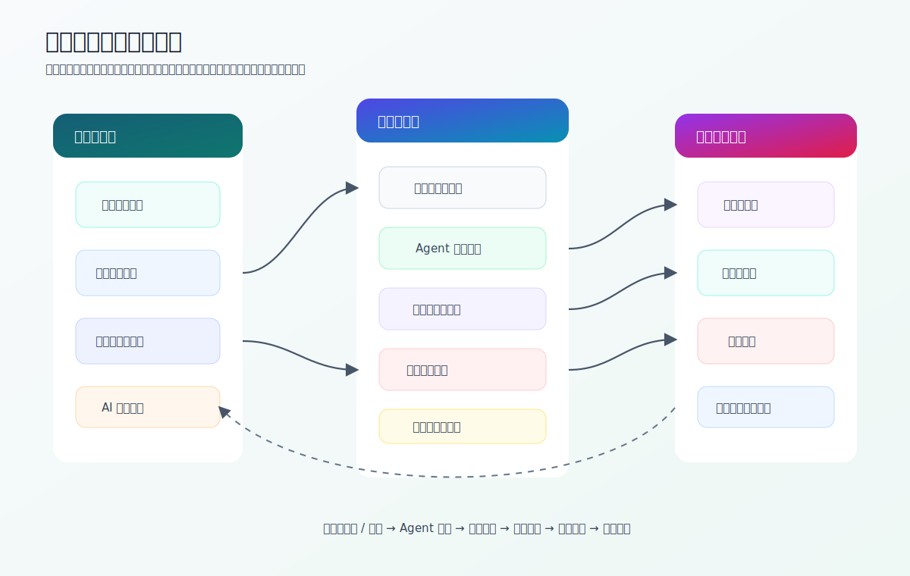

# 参赛作品说明书

## 封面

| 项目 | 内容 |
|---|---|
| 标题 | 参赛作品说明书 |
| 作品名称 | 同源：基于多智能体与 AIGC 的非遗文化数字生命共创平台 |
| 完成时间 | 2026 年 5 月 |

> 匿名评审版说明：本文件已去除身份相关字段，仅保留作品内容。

## 一、作品简介

《同源》是一套面向非遗文化数字传播的智能交互平台。作品以“非遗数字生命”为核心概念，将地域非遗项目转化为可对话、可协作、可生成图像的文化 Agent。用户可以通过地图和图像画廊浏览不同地域的非遗内容，也可以进入多智能体聊天室，与多个器灵 Agent 进行实时交流，并让指定 Agent 根据自身文化原型生成图像作品。

作品的核心价值在于：把非遗从静态资料转化为具有人格表达、知识边界和创作能力的数字生命，使用户从“观看者”变成“对话者”和“共创者”。

## 二、设计原理

作品采用前后端分离架构，整体可划分为用户体验层、智能编排层、能力与数据层。

用户体验层负责地图入口、图像画廊、多智能体聊天室和 AI 图像共创界面。前端通过组合式状态管理维护房间列表、聊天历史、WebSocket 连接、流式消息分片和生图状态，使用户能够在同一界面中完成浏览、对话、生成和回看。

智能编排层负责把用户输入转换成可控的大模型任务。系统会根据聊天室中的 Agent 成员和用户问题选择发言者，并通过冷却机制避免重复发言。回答生成前，系统先从知识库检索相关非遗片段，再将 Agent 人设、知识片段、联网补充资料和输出约束统一组装成 Prompt。生成过程中，后端以 WebSocket 事件推送 Agent 开始、分片、结束和图片消息，前端据此实时渲染。

能力与数据层提供大模型调用、向量知识库、数据库持久化、状态缓存和对象存储。知识检索优先使用向量数据库，当外部服务不可用时自动回退到本地检索，保证系统在演示环境下仍具备基本可用性。图像生成结果会被上传至对象存储，并作为聊天室历史消息保存，形成可追溯的创作记录。

## 三、团队分工

本作品的开发工作可拆分为以下模块：

| 模块 | 工作内容 |
|---|---|
| 总体设计 | 作品主题、交互流程、技术路线、系统架构设计 |
| 后端开发 | REST API、多智能体编排、RAG 检索、WebSocket 流式通信、AIGC 生图与 OSS 归档 |
| 前端开发 | 地图入口、图像画廊、智能体库、聊天室、AI 生图面板和响应式交互 |
| 数据工程 | 非遗资料整理、知识库 JSONL 构建、图片资源组织和接口联调 |
| 测试文档 | 接口文档、功能测试、异常处理验证和参赛材料撰写 |

## 四、创新点

1. **非遗数字生命化**  
   作品将非遗对象设计为具有名称、头像、性格、语言风格、知识范围和约束条件的 Agent，使文化内容以“角色生命”的方式被感知，而不是以冷冰冰的资料条目呈现。

2. **知识增强与角色表达融合**  
   系统将 RAG 检索资料写入提示词，并规定资料优先级，降低大模型在文化知识问答中的幻觉风险。同时系统支持沉浸式无 RAG 角色，让部分 Agent 更适合叙事、情绪表达和文化想象。

3. **多智能体协同对话**  
   系统不是简单调用一个模型回答，而是根据问题和 Agent 知识范围选择发言者。用户可触发多 Agent 共同回答，系统也可根据对话内容产生接力发言，形成更接近真实讨论的文化传播场景。

4. **向量检索与本地兜底结合**  
   检索服务优先使用向量数据库进行语义召回；若向量服务不可用，系统仍可通过标题、内容、类别、地区、级别等字段进行本地评分检索，提升作品在比赛演示中的稳定性。

5. **生成式共创闭环**  
   用户可基于某个 Agent 的文化原型生成图像，生成结果进入聊天室并被保存。这样，用户的创作不再是孤立输出，而会成为后续对话、解释和传播的新素材。

6. **完整工程化实现**  
   作品具有前端页面、后端服务、数据库表、接口文档、异常处理、测试类、实时通信和对象存储，不只是概念 Demo，而是可继续部署和迭代的系统原型。

## 五、实用点

- 可用于非遗展览、研学课堂、博物馆导览、文旅宣传和校园文化活动。
- 可降低非遗学习门槛，用角色化语言解释历史、工艺、审美和地域文化。
- 可支持多视角讲解，不同 Agent 分别承担知识解释、审美描述、创意生成等任务。
- 可沉淀图像生成结果和聊天历史，为文化衍生创作提供素材。
- 可持续扩展新的地域、非遗项目、Agent 人设和知识库资料。

## 六、关键设计模式与工程亮点

| 设计思路 | 实现方式 | 作用 |
|---|---|---|
| 分层架构 | 接口层、业务层、数据访问层、实体与 DTO 分离 | 保持系统边界清晰 |
| 依赖注入 | 服务通过构造器注入组合 | 降低耦合，便于测试 |
| 构建器模式 | 复杂消息对象和 Agent 定义使用 Builder | 提升对象创建可读性 |
| 注册表模式 | 汇总不同地域的 Agent 静态定义 | 支持批量扩展 |
| 编排器模式 | 独立模块负责选择发言 Agent | 让协同规则可维护 |
| 策略分支 | RAG 知识 Prompt 与沉浸式 Prompt 分流 | 同时满足事实性和叙事性 |
| 实时发布 | WebSocket 按房间广播分片消息 | 提升对话即时感 |
| 异步任务 | 图像生成任务带状态缓存和进度推送 | 适合处理耗时生成流程 |

## 七、总结

本作品围绕非遗文化的当代表达，完成了“浏览 - 对话 - 检索 - 生成 - 保存”的完整链路。其亮点不只在于接入大模型，而在于通过多智能体编排、RAG 知识增强和生成式共创机制，把非遗内容组织成可持续互动的数字生命系统。后续可继续扩展知识库规模、完善身份权限、增强事实审核和多端适配，使作品具备更强的应用推广价值。
