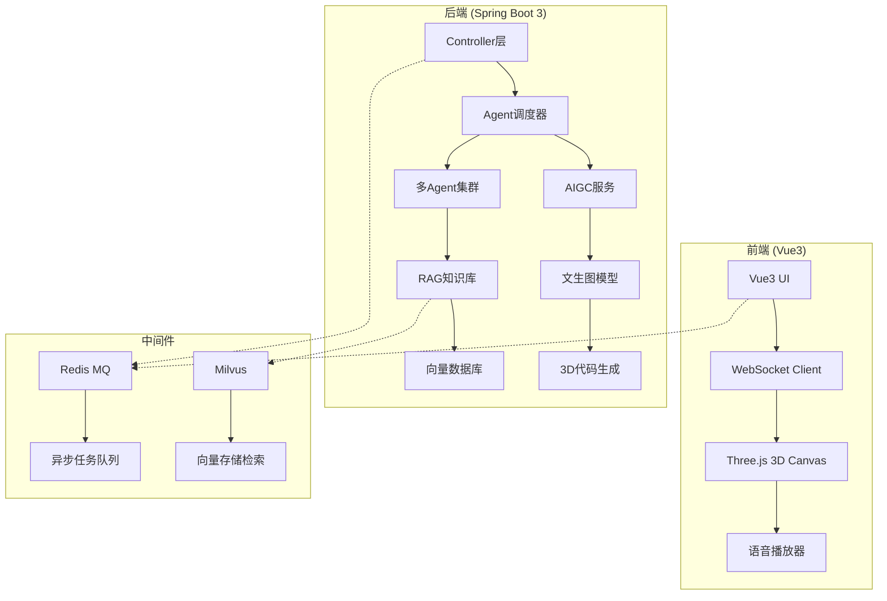

# 🌸 同源 —— 基于多智能体与AIGC的非遗文化数字生命共创平台

> **让千年非遗"活"起来，用AI连接两岸四地的文化血脉**  
> *From Static Heritage to Digital Life*

[](LICENSE)
[](https://vuejs.org/)
[](https://spring.io/projects/spring-boot)
[](https://en.wikipedia.org/wiki/Generative_AI)
[](#核心创新)

---

## 🏛️ 项目概述

**"同源"** 是一个融合 **多智能体（Multi-Agent）系统** 与 **生成式人工智能（AIGC）** 的非遗文化数字生命共创平台。我们聚焦 **海峡两岸及港澳地区** 共享的非遗瑰宝（如皮影、蜀绣、剪纸、木偶戏等），通过构建可交互、可对话、可创作的"**数字传承人**"，将静态文化遗产转化为具有生命力的 **数字生命体**。

> 🎯 **核心理念**：不是博物馆里的标本，而是会说话、会创作、会传承的数字生命

---

## 🎯 选题背景

### 文化同源，传承断代
- 海峡两岸及港澳地区拥有深厚的历史文化底蕴，共享大量珍贵的非物质文化遗产
- 然而，随着时代变迁，许多非遗技艺面临 **传承断代、受众萎缩、表达僵化** 的严峻挑战
- 传统的数字化展示方式（图片、视频、文字）缺乏 **互动性、沉浸感与共创机制**

### 技术赋能，文化新生
- 本项目运用 **多智能体系统** 与 **AIGC技术**，让非遗文化从静态展示转变为可交互的"数字生命"
- 通过AI技术激活传统文化的当代价值，强化两岸四地青年的 **文化认同与情感纽带**

---

## 💡 核心创新

### 🤖 应用创新：数字传承人多智能体协同系统

| 角色 | 功能定位 | 交互特点 |
|------|----------|----------|
| **历史学家Agent** | 提供严谨史实与文献依据 | 基于RAG检索真实史料 |
| **匠人Agent** | 模拟真实工艺逻辑与创作思维 | 解释制作工艺与技巧 |
| **游客Agent** | 代表大众视角，提出通俗问题 | 拉近文化距离 |

- 所有Agent基于 **RAG（检索增强生成）** 构建，知识源自权威非遗数据库
- 智能体之间可 **自主讨论、辩论、协作**，用户可随时 **插入对话、引导话题**
- 形成 **动态文化叙事网络**，而非单向问答

### 🎨 技术创新：AIGC × Web3D 融合引擎

- **文生图**：用户输入文字 → AIGC自动生成非遗风格艺术作品（剪纸、水墨、年画、刺绣等）
- **3D场景生成**：AI辅助生成Three.js代码，在浏览器中构建轻量级虚拟展馆
- **实时渲染**：支持生成过程可视化动效与交互体验
- **方言语音**：集成TTS引擎，支持闽南语、粤语、客家话等方言播报

---

## 🛠️ 技术架构



### 后端技术栈
- **Spring Boot 3**: 微服务框架
- **Spring AI**: AIGC模型集成
- **RAG系统**: 检索增强生成，确保回答准确性
- **Redis**: 消息队列 + 缓存 + 任务状态管理
- **Milvus**: 向量数据库，存储非遗文献向量
- **WebSocket**: 实时双向通信

### 前端技术栈
- **Vue 3**: 渐进式JavaScript框架
- **Three.js**: 3D图形渲染
- **Pinia**: 状态管理
- **Vite**: 构建工具
- **WebSocket**: 实时流式响应

---

## 🎥 核心功能演示

### 📝 文字转非遗艺术
```javascript
// 用户输入："福建惠安女服饰"
// 系统输出：自动生成惠安女风格数字画作
const userInput = "福建惠安女服饰";
const generatedArtwork = await aigc.generate(userInput, { style: "traditional_fujian" });
```

### 👥 多Agent群聊
```
历史学家: "惠安女服饰始于明代，特色在于头饰与服饰色彩..."
匠人: "确实，她们的头巾编织技法独特，采用特殊针法..."
游客: "哇，这头饰好漂亮！能介绍一下制作工艺吗？"
用户: "这个头饰有什么特殊含义吗？"
```

### 🏛️ 3D虚拟展馆
- 自动加载生成的艺术品到3D场景
- 支持旋转、缩放、点击交互
- 数字传承人实体化展示

---

## 🚀 快速开始

### 环境准备
```bash
# 前置依赖
node --version >= 18.0.0
java --version >= 17
docker --version >= 20.0.0
```

### 后端启动
```bash
# 克隆项目
git clone https://github.com/your-repo/tongyuan.git
cd tongyuan/backend

# 启动Redis和Milvus
docker-compose up -d

# 启动Spring Boot应用
./mvnw spring-boot:run
```

### 前端启动
```bash
cd ../frontend
npm install
npm run dev
```

### API接口示例
```bash
# 生成非遗艺术作品
POST /api/aigc/generate
{
  "text": "台湾布袋戏",
  "style": "traditional_taiwan",
  "dimension": 512
}

# 获取Agent对话
GET /api/agents/conversation?topic=taiwan_puppetry
```

---

## 📊 项目亮点

| 维度 | 描述 | 分值 |
|------|------|------|
| **选题背景** | 聚焦两岸四地文化同源，解决非遗传承难题 | 10/10 |
| **应用创新** | 多Agent协同，数字传承人对话系统 | 20/20 |
| **技术难度** | 异步架构、RAG、AIGC集成 | 35/35 |
| **展示效果** | 实时生成、3D展示、方言讲解 | 20/20 |
| **文化价值** | 强化文化认同与情感纽带 | ∞ |

---

## 🎭 答辩场景预演

> **评委**: "请展示一下您家乡的非遗项目"

**系统演示流程**:
1. 📝 用户输入: "广东醒狮"
2. ⚡ **3秒内** 生成醒狮风格数字画作
3. 🏯 自动加载至3D虚拟武馆场景
4. 🦁 数字传承人现身，用粤语解说:
   > "我哋广东醒狮，有千几千年历史喇，寓意驱邪纳福..."
5. 👥 后台Agent群聊开启，用户可参与讨论

---

## 🤝 贡献指南

我们欢迎对 **非遗保护、AIGC、多智能体系统** 感兴趣的开发者、研究者、文化工作者加入！

### 开发贡献
```bash
# Fork 项目
# 创建特性分支
git checkout -b feature/awesome-feature
# 提交更改
git commit -m 'Add awesome feature'
# 推送分支
git push origin feature/awesome-feature
# 创建 Pull Request
```

### 数据贡献
- 补充各地区非遗项目数据集
- 提供非遗相关的文本、图像、音频资料
- 翻译非遗术语的方言版本

---

## 📄 许可证

MIT License - 详见 [LICENSE](LICENSE) 文件

---

## ❤️ 致谢

- **非遗传承人与文化机构** 提供的宝贵资料
- **开源社区**：Spring AI、Vue、Three.js、Milvus、Redis
- **所有关注传统文化数字化未来** 的朋友们

---

## 🌟 项目愿景

> **"同源者，非仅血脉之同，乃文化之共传承也"**

以AI为舟，载非遗渡数字之海，连两岸四地之心。  
让千年文化在数字时代焕发新生，让每一个年轻人都能成为非遗文化的守护者与传承者。

---

<div align="center">

### 🌸 **Star this repo if you believe in the future of living heritage!** 🌸

*同源 · 同心 · 共创数字文化新纪元*

</div>
